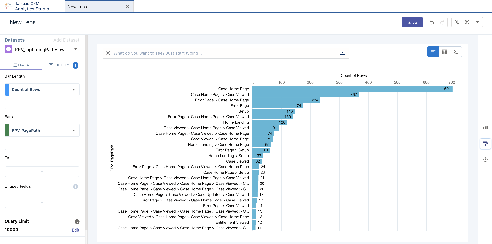
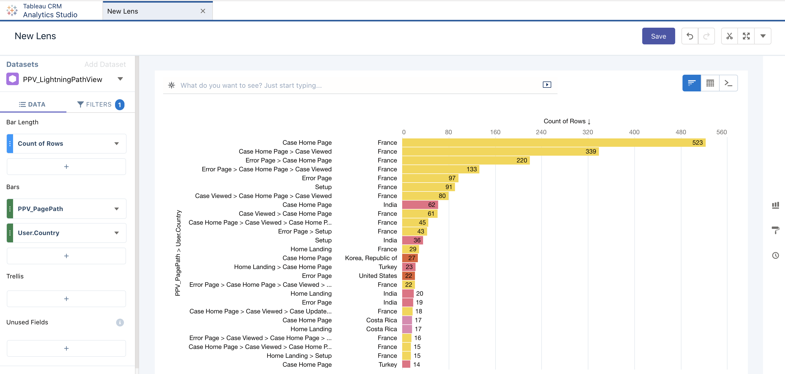
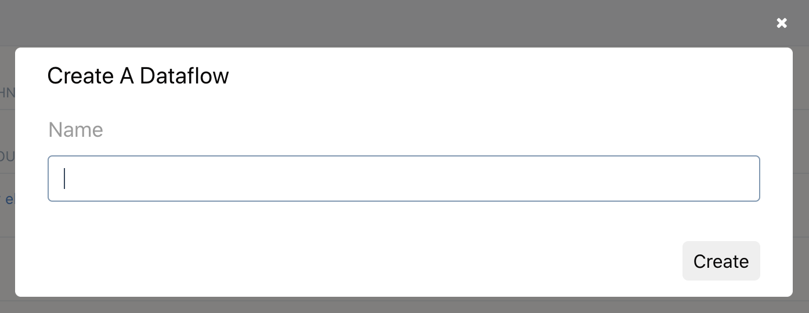

# PagePathViews

## My customer wants to view the most common path that users are navigating...
After importing the dataflow of this repository in your TCRM, you will be able to have dashboard like this:


Or like this (this includes the country of the user):


If you see some "setup" page you might consider filtering out in your dashboard the admins!!

## Create the dataflow in your Tableau CRM

### Step 1
- Log in ```TCRM``` and find the ```Data Manager``` link
- Select the ```Dataflows & Recipes``` link

### Step 2: 
- Click on ```Create Dataflow``` 
- Select the name of your choice, for example ```PPV_Dataflow"``` 

### Step 3: 
- Download the Dataflow JSON source from this repository at [/Dataflow.json](https://raw.githubusercontent.com/VinceFINET/PagePathViews/main/Dataflow.json)
- Select the fourth button to load the Dataflow JSON of this repository 
- Click on continue to confirm
- Select the Dataflow JSON file that you download previously.
- Click on ```Update Dafaflow``` and click again to launch it.

## Troubleshooting the Dataflow
- We assume that the dataset ```LightningPageViewWithUsers``` exists. You may need to update (not in the file but in the Dataflow editor within TCRM) the ```PPV_Edgemart_1``` node (```edgemart``` type) with the appropriate alias to use.
- The resulting dataset ```PPV_LightningPathView``` will be created the first time in the ```Shared``` application. Feel free to move it in another application in TCRM.
- Don't forget the schedule the dataflow after the one from Shield Event Monitoring application.

## Create your first lens
- After the dataset is created you can start construct a ```Lens``` based on ```PPV_LightningPathView``` for example group by ```PPV_PagePath```, Order by ```count``` descending and don't forget to filter with ```PPV_IsLast=true``` condition.
- Happy lensing and dashboarding!!!
